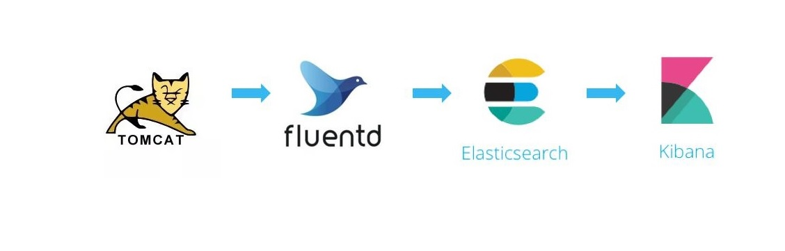

# Elastic Stack (EFK) Demo Stand
By [Dmitry Buhtiyarov](https://github.com/dbuhtiyarov/docker-demo/tree/master/docker-compose/elk)

## Architecture


## Installation
1) On the ELK host go to `elk` directory and start ELK stack with Docker compose:
```
$ cd elk
$ docker-compose up -d
```

## Storage

### How can I persist Elasticsearch data?

The data stored in Elasticsearch will be persisted after container reboot but not after container removal.

In order to persist Elasticsearch data even after removing the Elasticsearch container, you'll have to mount a volume on
your Docker host. Update the `elasticsearch` service declaration to:

```yml
elasticsearch:

  volumes:
    - /path/to/storage:/usr/share/elasticsearch/data
```

This will store Elasticsearch data inside `/path/to/storage`.

**NOTE:** beware of these OS-specific considerations:
* **Linux:** the [unprivileged `elasticsearch` user][esuser] is used within the Elasticsearch image, therefore the
  mounted data directory must be owned by the uid `1000`.
* **macOS:** the default Docker for Mac configuration allows mounting files from `/Users/`, `/Volumes/`, `/private/`,
  and `/tmp` exclusively. Follow the instructions from the [documentation][macmounts] to add more locations.

[esuser]: https://github.com/elastic/elasticsearch-docker/blob/016bcc9db1dd97ecd0ff60c1290e7fa9142f8ddd/templates/Dockerfile.j2#L22
[macmounts]: https://docs.docker.com/docker-for-mac/osxfs/
```

## Testing Scenario

### Tomcat Sample WAR can be taken here:
- https://tomcat.apache.org/tomcat-7.0-doc/appdev/sample/sample.war
- https://github.com/dbuhtiyarov/docker-demo/blob/master/docker-compose/elk/target/sample.war

